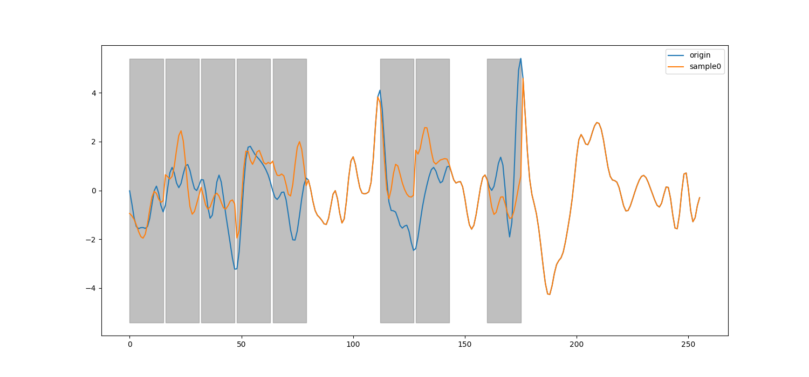

# MAR-MNIST 


## Description 
This project is an implementation based on the MAR model for a masked conditional eeg wave generative model under the Mixed Motor Imagery dataset. 

The repo's implementation draws inspiration from the following references:

1. [MAR: PyTorch implementation of MAR+DiffLoss](https://github.com/LTH14/mar)
2. [mnist-dits: Diffusion Transformers (DiTs) trained on MNIST dataset](https://github.com/owenliang/mnist-dits)
3. [tiny-diffusion: A minimal PyTorch implementation of probabilistic diffusion models for 2D datasets.](https://github.com/tanelp/tiny-diffusion)
4. [MAE: PyTorch implementation of MAE](https://github.com/facebookresearch/mae)
5. [BENDR: BERT-like self-supervision pre-training for EEG data](https://github.com/SPOClab-ca/BENDR)
6. [RoFormer: Rotary Transformer](https://github.com/ZhuiyiTechnology/roformer) 

The repo also considers the research presented in the paper "Autoregressive Image Generation without Vector Quantization" by Tianhong Li, Yonglong Tian, He Li, Mingyang Deng, and Kaiming He [(arXiv preprint arXiv:2406.11838)](https://arxiv.org/abs/2406.11838) published in 2024. 

## Setup 
Instructions of setup are as follows: 
```bash
pip install -r requirements.txt
```

## Usage 
Here is how you can use this project. 
Run training script:
```bash
CUDA_VISIBLE_DEVICES=0,1,2,3,4,5,6,7 python train.py
```
Then, run inference script:
```bash
python inference.py
```
The results will save into dir 'results'.
